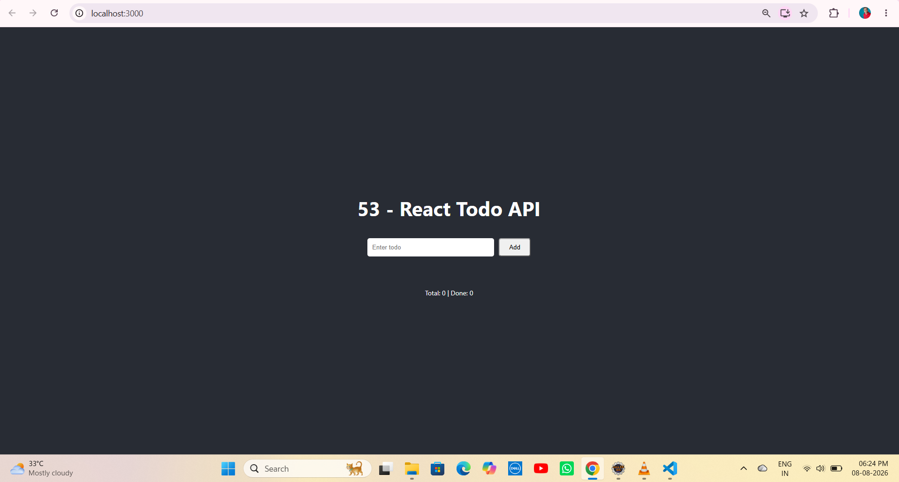
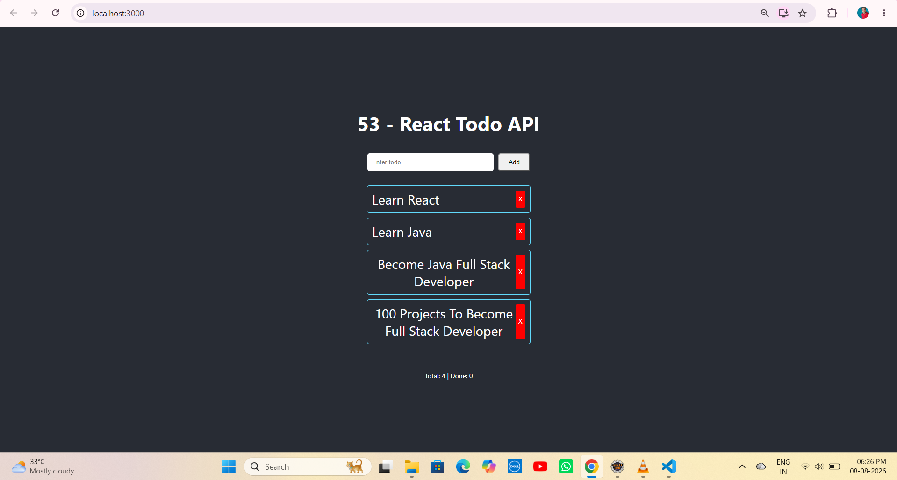
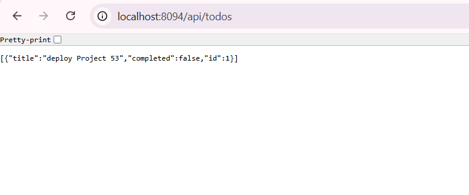
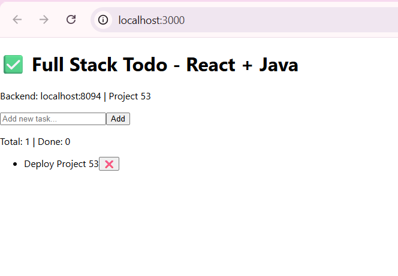

# 📝 Project 53 – React Todo + API | Full Stack Todo App


---

# 📖 Project Overview

**React Todo + API** is Project 53 of **Tier 6 – Frontend Mastery with React**, developed using **React 18**, **Spring Boot 4.1.0 REST API (Project 43)**, **Axios**, and **H2 Database**.

Full Stack Todo Application demonstrating complete frontend-backend integration. React frontend running on port 3000 communicates with Spring Boot REST API running on port 8094 via Axios HTTP client. The application handles CORS, JSON data flow, state management with React Hooks, and persists data in H2 in-memory database. Users can perform full CRUD operations from a modern, responsive dark UI without using Postman - proving end-to-end Full Stack workflow.

---

# ✨ Features

- Create, View, Delete Todos from React UI
- Real-time Todo count - Total and Done
- RESTful integration with Spring Boot backend
- JSON request/response handling with Axios
- CORS handling with `@CrossOrigin(origins = "http://localhost:3000")`
- Dark themed responsive UI
- React Hooks - useState, useEffect
- H2 in-memory database persistence
- Full Stack CRUD without Postman

---

# 🛠 Technologies Used

- React 18.2.0 (Create React App)
- Java 21
- Spring Boot 4.1.0
- Spring Web (REST)
- Spring Data JPA
- Hibernate 7.4.1
- Axios 1.6+
- H2 Database (in-memory)
- Maven 3.9+
- JavaScript (ES6+)
- Node.js & npm
- Apache Tomcat 11.0.22 (Embedded)
- VS Code / STS / Eclipse IDE

---

# 📂 Project Structure

```text
53-react-todo-api
│
├── public
│   └── index.html
│
├── src
│   ├── App.js              # Main Todo logic - Axios CRUD + Hooks
│   ├── App.css
│   ├── index.js
│   └── index.css
│
├── screenshots
│   ├── demo1.png           # Dark UI - Empty State
│   ├── demo2.png           # Dark UI - 4 Todos Added
│   ├── demo3.png           # Backend JSON - localhost:8094/api/todos
│   └── demo4.png           # Initial White UI - Project 53
│
├── .gitignore
├── package.json
├── package-lock.json
└── README.md
```

---

# ▶ How to Run

## 1⃣ Clone the Repositories

```bash
# Backend - Project 43
git clone https://github.com/raviteja-dev950/43-rest-todo-api.git

# Frontend - Project 53
git clone https://github.com/raviteja-dev950/53-react-todo-api.git
```

---

## 2⃣ Run Backend First (Port 8094)

- Open **STS / Eclipse IDE**
- Import `43-rest-todo-api` as **Existing Maven Project**
- Verify **application.properties**

```properties
spring.application.name=43-rest-todo-api
server.port=8094
spring.datasource.url=jdbc:h2:mem:tododb
spring.datasource.username=sa
spring.datasource.password=
spring.jpa.hibernate.ddl-auto=update
```

- Add CORS in Controller:

```java
@CrossOrigin(origins = "http://localhost:3000")
@RestController
@RequestMapping("/api/todos")
public class TodoController { ... }
```

- **Run As → Spring Boot App**
- Visit `http://localhost:8094/api/todos` → Should return `[]` or JSON like demo3

---

## 3⃣ Run Frontend (Port 3000)

```bash
cd 53-react-todo-api
npm install
npm start
```

Open:

```text
http://localhost:3000
```

---

## 4⃣ Application Flow

```text
User (localhost:3000 - React Dark UI)
      │
      ▼
React - App.js (useState, useEffect, Axios)
      │
      ▼
Axios HTTP Request
      │
      ▼
@CrossOrigin Check (localhost:3000 allowed)
      │
      ▼
@RestController @RequestMapping("/api/todos")
      │
      ▼
Service Layer -> JpaRepository -> H2
      │
      ▼
JSON Response -> Axios -> setTodos() -> UI Re-render
```

---

# 📸 Screenshots

### Demo 1 - Dark UI Empty State
Initial React app with no todos - Total: 0 | Done: 0


### Demo 2 - Dark UI with Todos
Full Stack working - 4 Todos added via API - Learn React, Learn Java, Become Java Full Stack Developer


### Demo 3 - Backend JSON API
Spring Boot REST API returning JSON - `[{"title":"deploy Project 53","completed":false,"id":1}]`


### Demo 4 - Initial White UI Version
First version of Project 53 - Full Stack Todo - React + Java with backend status


---

# 🧪 API Testing Examples

```bash
# GET All Todos
curl http://localhost:8094/api/todos

# POST Create (Same as React UI does)
curl -X POST http://localhost:8094/api/todos -H "Content-Type: application/json" -d '{"title":"deploy Project 53","completed":false}'

# DELETE
curl -X DELETE http://localhost:8094/api/todos/1
```

**Frontend Testing:**
1. Open `http://localhost:3000` (demo1 - empty)
2. Add "Learn React" -> Check `http://localhost:8094/api/todos` (demo3 - JSON appears)
3. Add 3 more todos -> UI shows Total: 4 (demo2)
4. Click X to delete -> UI updates instantly

---

# 🎯 Learning Outcomes

- Understanding Full Stack architecture - React frontend + Spring Boot backend
- Implementing CORS with `@CrossOrigin(origins = "http://localhost:3000")`
- Using Axios for REST API consumption from React
- Managing React state with `useState` and `useEffect`
- Handling async operations with Promises and Axios
- Running two servers simultaneously - Port 3000 and 8094
- Debugging Full Stack issues - Browser Network tab, Console, Spring Boot logs
- Handling JSON data flow between Java and JavaScript
- Building responsive dark UI with CSS
- Understanding component lifecycle and re-rendering
- Git workflow - `git pull` before `git push` to resolve merge conflicts
- Creating professional project structure for Full Stack apps

---

# 🚀 Future Enhancements

- 🔐 Add Authentication - Login / Register (Project 54)
- ✏️ Add Edit Todo with PUT API
- 🔍 Add Filter - All / Active / Completed
- 🌗 Add Light / Dark theme toggle
- 📄 Add pagination and search
- 🐬 Switch H2 to MySQL with Docker
- ☁ Deploy Frontend to Vercel and Backend to Render
- 🧪 Add Jest + React Testing Library tests
- 📊 Add Tailwind CSS for better styling

---

# 👨💻 Author

**Ravi Teja**

**Java Full Stack Developer**

**100 Java Full Stack Projects Challenge**

**Project 53 / 100**

**Tier 6 – Frontend Mastery with React**

---

## ⭐ Support

If you found this project helpful, consider giving it a **⭐ Star** on GitHub.

**Backend:** [43-rest-todo-api](https://github.com/raviteja-dev950/43-rest-todo-api) | **Frontend:** [53-react-todo-api](https://github.com/raviteja-dev950/53-react-todo-api)

